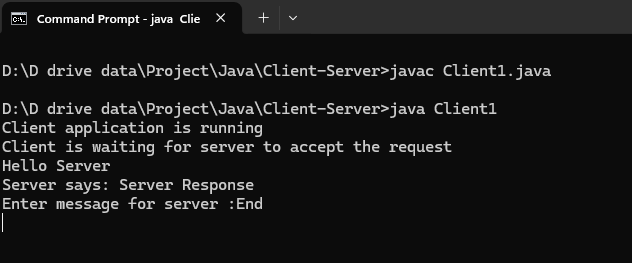
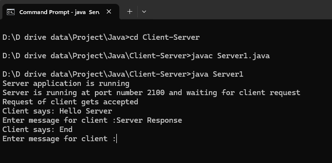

# 💬 Java Text-Chat Application (Single-Threaded)

A sequential, single-threaded Java client-server text chatting application. This program supports strictly text-based messaging between a client and server.

> ⚠️ **Note:** This application does **not** support file sharing, media attachments, or image transfers over the network. It is purely designed for text message communication.

---

## ✨ Features

* **Strict Text Chatting:** Low-latency bidirectional exchange of raw text streams.
* **Single-Threaded Sequence:** Dedicated connection processing handling one active chat session at a time.
---

## 📁 Project Architecture

```
├── Client-Server/
│    |── Server1.java       # Hosts the chat port and processes the text stream
│    |── Client1.java       # Connects to the host to send and receive text inputs
├── Output/               # Local directory containing outputs
│   ├── ClientChat.png    # Visual image snapshot of Client
│   └── ServerChat.png    # Visual image snapshot of Server
└── README.md             # Project documentation
```

---

## 🚀 How to Run the Project

### Step 1: Compile the Code
Navigate to project root folder and compile the Java source files:
```bash
javac Server1.java
```

### Step 2: Start the Chat Server
Run the Server application to open up the communication gateway:
```bash
java Server1
```

### Step 3: Connect the Chat Client
Open a **new terminal window** and compile the Client application:
```bash
javac Client1.java
```

### Step 4: Start the Chat Client
Run the Client application to begin typing text:
```bash
java Client1


---


## 🖼️ Application Preview

Here are the output images showcasing the running application:

### Server and Client Communication


### Active Text Exchange

